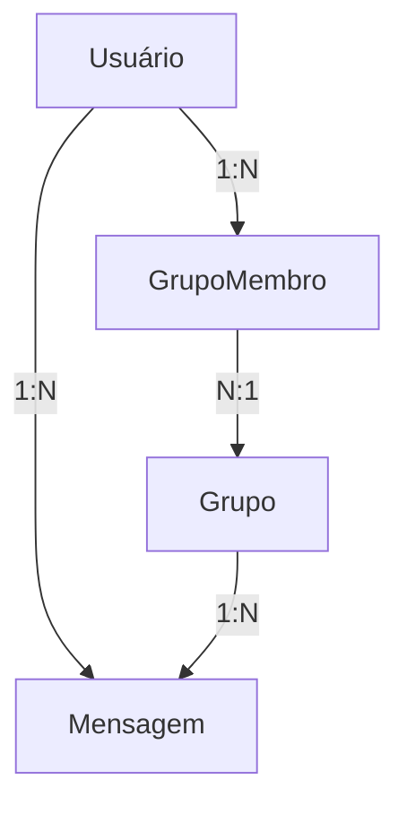

# 💬 API CodeNet


---

## 🚀 Visão Geral

A API do **CodeNet** é uma plataforma de comunicação voltada para desenvolvedores, oferecendo funcionalidades de criação de grupos, envio de mensagens, controle de membros e gerenciamento de usuários.

Construída com **ASP.NET Core 8.0** e **C# 12**, a aplicação adota uma **arquitetura limpa**, boas práticas de segurança com **JWT**, validações robustas usando **FluentValidation**, e documentação automática via **Swagger**.

---

## 🛠️ Tecnologias Utilizadas

- ASP.NET Core 8
- C# 12
- Entity Framework Core
- SQL Server
- Swagger/OpenAPI
- FluentValidation
- JWT (Json Web Token)

---

## ⚙️ Pré-requisitos

- Visual Studio 2022
- .NET SDK 8.0
- SQL Server
- Git

---

## 🔄 Fluxo de Funcionamento



---

## 📃 Formato de Respostas JSON

Todas as respostas da API seguem o mesmo padrão de estrutura:

```json
{
  "success": true,
  "mensagem": "Mensagem descritiva",
  "dados": []
}
```

### Exemplo de sucesso (200 OK):
```json
{
    "success": true,
    "mensagem": "Todos os grupos listados com sucesso!",
    "dados": [
        {
            "id": "d5973ee2-2204-4b99-9c11-6e075b40b73b",
            "titulo": "C# e .NET Brasil",
            "descricao": "Encontros, dúvidas e novidades sobre C# e o ecossistema .NET.",
            "criadoEm": "2025-04-24T14:28:38.9561713"
        }
    ]
}
```

### Exemplo de erro (400 Bad Request):
```json
{
    "success": false,
    "mensagem": "Erro de operação",
    "dados": "Usuário já participa desse grupo!"
}
```

### Exemplo de erro (404 Not Found):
```json
{
    "success": false,
    "mensagem": "Erro de busca",
    "dados": "Esse grupo não existe"
}
```

---

## 📚 Documentação da API

Acesse a documentação completa da API através do Swagger:  
`https://localhost:7065/swagger/`

---

### 📋 Endpoints Disponíveis

#### 👤 Usuários
| Método | Endpoint | Descrição |
| :--- | :--- | :--- |
| POST | `/api/v1/auth/register` | Registra um novo usuário |
| POST | `/api/v1/auth/login` | Realiza login e gera token JWT |
| GET | `/api/v1/auth/me` | Retorna dados do usuário logado |
| PUT | `/api/v1/users/me` | Edita perfil do usuário |
| PUT | `/api/v1/users/alterar-senha` | Altera a senha do usuário |
| DELETE | `/api/v1/users/me` | Deleta o próprio usuário |
| GET | `/api/v1/users` | Lista todos os usuários (admin) |
| DELETE | `/api/v1/users/adm/{id}` | Deleta qualquer usuário (admin) |

#### 👥 Grupos
| Método | Endpoint | Descrição |
| :--- | :--- | :--- |
| POST | `/api/v1/grupos/criar-grupo` | Cria um novo grupo |
| PUT | `/api/v1/grupos/{idGrupo}` | Edita informações de um grupo |
| DELETE | `/api/v1/grupos/{idGrupo}` | Exclui um grupo (somente admin) |
| GET | `/api/v1/grupos` | Lista todos os grupos |

#### 📢 Membros
| Método | Endpoint | Descrição |
| :--- | :--- | :--- |
| GET | `/api/v1/grupos/{idGrupo}/membros` | Lista membros de um grupo |
| GET | `/api/v1/grupos/{idGrupo}/entrar-grupo` | Entra em um grupo |
| GET | `/api/v1/grupos/{idGrupo}/sair-grupo` | Sai de um grupo |
| GET | `/api/v1/grupos/meus-grupos` | Lista grupos que o usuário participa |

#### 💬 Mensagens
| Método | Endpoint | Descrição |
| :--- | :--- | :--- |
| POST | `/api/v1/grupos/{idGrupo}/mensagens/enviar-mensagem` | Envia uma nova mensagem para o grupo |
| GET | `/api/v1/grupos/{idGrupo}/mensagens` | Lista todas mensagens do grupo |
| PUT | `/api/v1/grupos/{idGrupo}/mensagens/{idMensagem}/editar-mensagem` | Edita uma mensagem |
| DELETE | `/api/v1/grupos/{idGrupo}/mensagens/{idMensagem}/excluir-mensagem` | Exclui uma mensagem |

---

### ⚠️ Possíveis Códigos de Resposta

- **200 OK**: Operação realizada com sucesso.
- **400 Bad Request**: Dados inválidos na requisição.
- **401 Unauthorized**: Token inválido ou não enviado.
- **403 Forbidden**: Sem permissão para realizar a operação.
- **404 Not Found**: Recurso não encontrado.
- **500 Internal Server Error**: Erro interno no servidor.

---

## 🧬 Desafios Enfrentados

- Gerenciamento de autenticação e autorização com JWT.
- Transferência automática de admin em grupos.
- Controle de relacionamentos complexos (usuários, grupos, mensagens).
- Validação robusta usando FluentValidation.
- Documentação clara via Swagger.
- Estruturação RESTful real.

---

## 💻 Instalação

```bash
# Clone o repositório
git clone https://github.com/seu-usuario/CodeNet-API.git

# Entre na pasta do projeto
cd CodeNet.sln

# Restaure os pacotes
dotnet restore

# Atualize o banco de dados
dotnet ef database update
```

---

## 📂 Estrutura do Projeto

```
├── CodeNet.sln
│
├── CodeNet.Api/
│   ├── Controllers/
│   ├── Program.cs
│   ├── appsettings.json
│
├── CodeNet.Application/
│   ├── Dto/
│   ├── Interfaces/
│   ├── Services/
│   ├── Validations/
│
├── CodeNet.Core/
│   ├── Models/
│   ├── IRepositories/
│   ├── Shared/
│
└── CodeNet.Infrastructure/
    ├── Context/
    ├── Repositories/
    ├── Migrations/
```

---

## ⚖️ Licença

Este projeto está sob a licença MIT - veja o arquivo LICENSE para detalhes.

---

## 📧 Contato

Victor André Lopes Brasileiro - valb1@ic.ufal.br

